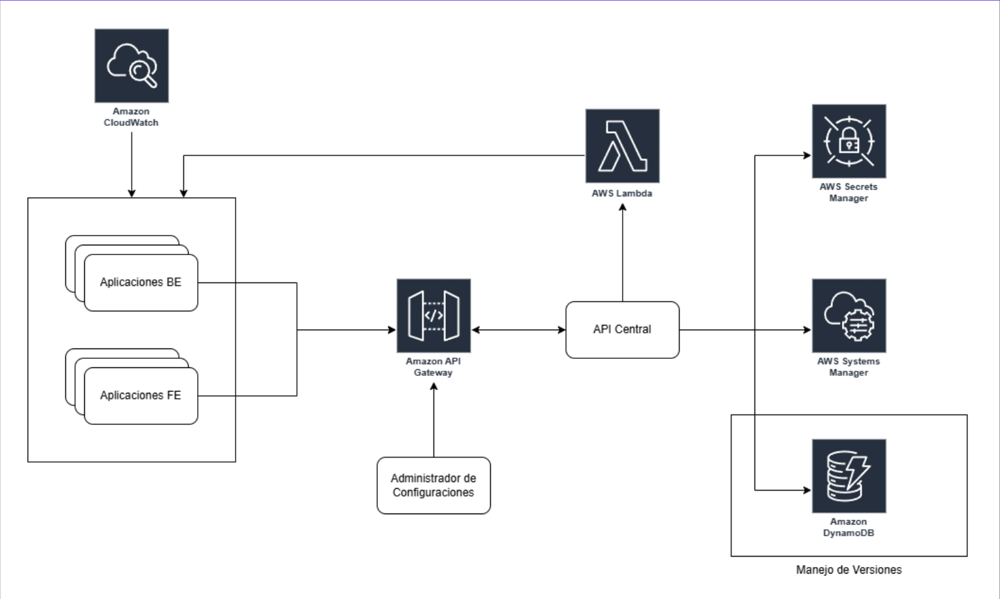
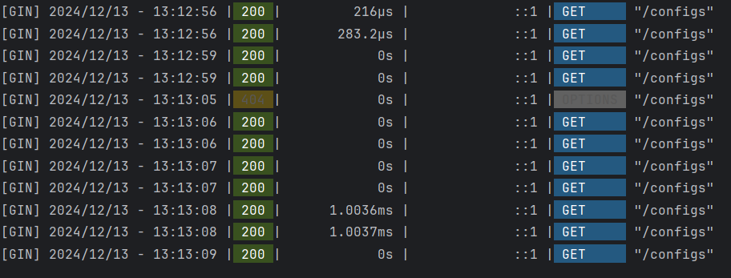

# MVP - Sistema de Gestión de Configuraciones

Este proyecto contiene el código fuente del MVP del Sistema de Gestión de Configuraciones. Está construido con las siguientes tecnologías:

- **TypeScript - React**: Para el desarrollo del frontend.
- **Golang - Gin**: Para la implementación del backend.

## **Descripción General**


Este proyecto permite ingresar y gestionar configuraciones de una o varias aplicaciones. Inicialmente está diseñado para aplicaciones REST API, pero puede extenderse a otros tipos de sistemas. Las configuraciones que se pueden gestionar incluyen:

- Secretos y claves API.
- Variables de entorno.
- Parámetros funcionales que determinan comportamientos específicos de las aplicaciones (e.g., activar/desactivar funcionalidades, tomar decisiones condicionales).

El objetivo principal de esta aplicación es proporcionar un sistema centralizado y seguro para la gestión de configuraciones, mejorando la eficiencia y la seguridad en entornos distribuidos.

## **Arquitectura del Sistema**

Haciendo uso de las facilidades que actualmente ofrece la nube de AWS, este sistema sigue una arquitectura robusta que incluye:



### **Componentes Clave**

1. **Frontend (React + TypeScript):** Proporciona una interfaz amigable para que los usuarios puedan gestionar configuraciones.
2. **Backend (Go + Gin):** Exposición de una API REST para realizar operaciones CRUD sobre las configuraciones.
3. **Base de Datos (SQLite):** Almacenamiento centralizado de configuraciones para el MVP.
4. **Integración con AWS:** Arquitectura preparada para integrar servicios como AWS Systems Manager, Secrets Manager y AppConfig para futuras expansiones.

## **Beneficios del Sistema**

Este MVP ayudó a demostrar la importancia de contar con un sistema de gestión de configuraciones en las organizaciones, logrando los siguientes beneficios:

1. **Centralización y Seguridad:**
   - Configuraciones gestionadas de manera centralizada para aplicaciones backend y frontend.
   - Reducción del riesgo de errores y vulnerabilidades.

2. **Eficiencia y Optimización:**
   - Proporciona un enfoque en el desarrollo de funcionalidades, permitiendo que los desarrolladores se concentren en el código y no en configuraciones manuales.
   - Mejor tiempo de respuesta y funcionamiento eficiente de las aplicaciones.

3. **Disponibilidad Garantizada:**
   - Gestión dinámica de configuraciones, asegurando que las actualizaciones no interrumpan el funcionamiento del sistema.

## **Resultados del MVP**



- **Tiempos de Respuesta Bajos:** El sistema demostró un rendimiento eficiente, con tiempos de respuesta rápidos para operaciones CRUD.
- **Alta Disponibilidad:** Confirmó que el sistema puede garantizar la disponibilidad de las aplicaciones frente a actualizaciones frecuentes.
- **Escalabilidad:** Aunque diseñado como un MVP, la arquitectura puede escalar fácilmente para manejar cientos de configuraciones y aplicaciones distribuidas.

## **Instrucciones de Configuración y Ejecución**

### **Backend**
1. Instala las dependencias:
   ```bash
   go mod tidy
   ```
2. Inicia el servidor:
   ```bash
   go run main.go
   ```

### **Frontend**
1. Instala las dependencias:
   ```bash
   npm install
   ```
2. Inicia el servidor de desarrollo:
   ```bash
   npm start
   ```

3. Accede a la aplicación en: [http://localhost:3000](http://localhost:3000)

## **Próximos Pasos**

1. **Integración con AWS:**
   - Incorporar AWS Systems Manager y Secrets Manager para almacenamiento seguro de configuraciones en entornos de producción.
2. **Compatibilidad Multicloud:**
   - Ampliar la compatibilidad para entornos Azure y Google Cloud Platform.
3. **Soporte para Configuraciones Avanzadas:**
   - Gestión de flags de funcionalidades, configuraciones regionales y parámetros de rendimiento.
4. **Monitoreo y Alertas:**
   - Integrar herramientas como Prometheus y Grafana para monitoreo en tiempo real.

## **Conclusión**

Este MVP confirma la relevancia y efectividad de un sistema centralizado de gestión de configuraciones para mejorar la seguridad, disponibilidad y eficiencia en sistemas distribuidos. Con una arquitectura extensible y un rendimiento demostrado, este proyecto sienta las bases para una solución robusta en entornos empresariales.

---

### **Contactos y Agradecimientos**
Si tienes preguntas o sugerencias sobre este proyecto, no dudes en contactarnos o contribuir con mejoras a través de [GitHub](#).